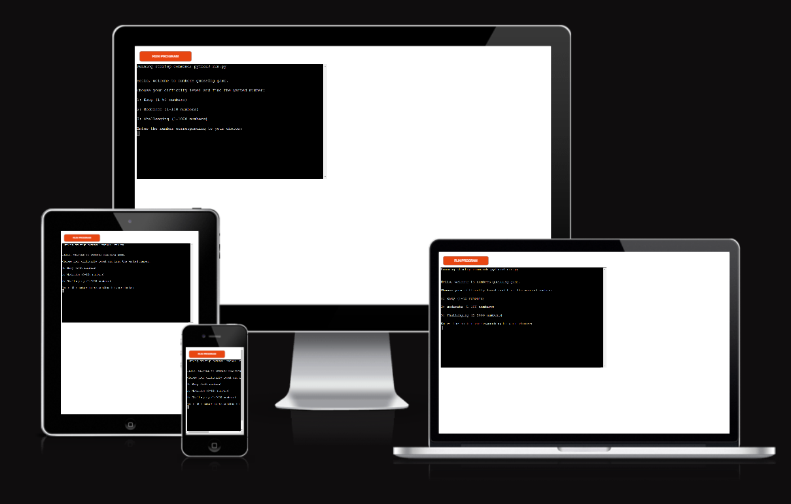
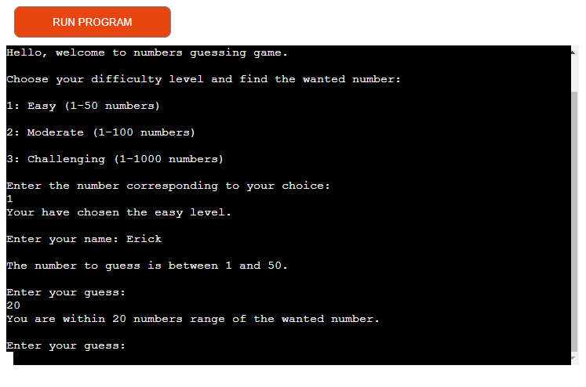
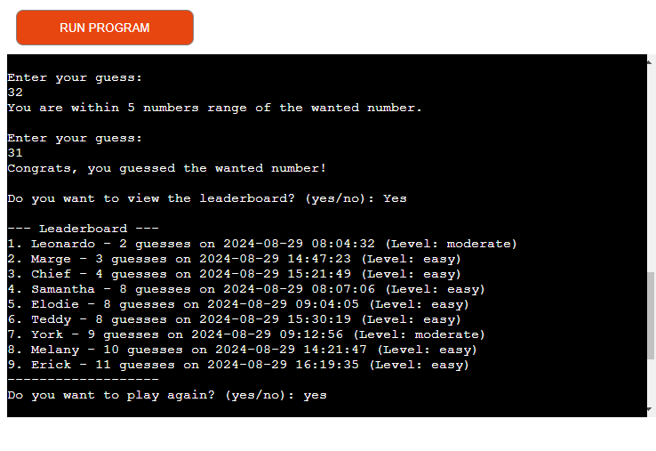
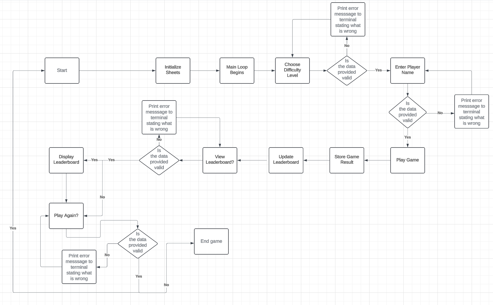

# Guessing Numbers

## Introduction

This is a Python terminal game that allows players to guess a number, keep track of their scores, and view a leaderboard. The game runs in a terminal environment and integrates with Google Sheets to store player data.

[Link to live page](https://guessing-game1-92439eba22ca.herokuapp.com/)

## How to Play

- Players start by choosing a difficulty level.
- The game will randomly select a number within a range depending on the chosen difficulty.
- Players guess the number, and the game provides feedback on whether the guess is too high, too low, or correct.
- The number of guesses is tracked, and the player's result is stored in a Google Sheet.

## Features

### Existing Features

- **Difficulty Levels:** Players can choose between Easy, Moderate, and Challenging levels.
- **Random Number Generation:** The game randomly selects a number within a range based on the chosen difficulty.

- **Guess Feedback:** The game provides feedback on whether the guess is too high, too low, or correct.
- **Leaderboard:** The top players are tracked in a Google Sheets leaderboard, which is updated after each game.
- **Error Handling:** The game handles invalid inputs (e.g., non-numeric input, out-of-bounds numbers) and guides the player to make valid guesses.

### Future Features

- **Customization:** Allow players to set their own number ranges and difficulties.
- **Multiplayer Mode:** Add support for multiplayer sessions where players compete for the best score.
- **Enhanced Leaderboard:** Include additional statistics such as the fastest time to guess the number.

## Flow chart

## Data Model

This game uses Google Sheets to store and manage player data, ensuring persistence and real-time updates.

### 1. Google Sheets Integration

The game uses the `gspread` library to interact with Google Sheets. Two main worksheets are utilized:

- **Guesses Worksheet (`guesses`):** Stores each player's game session data.
- **Leaderboard Worksheet (`leaderboard`):** Tracks the top 10 player scores across all difficulty levels.

### 2. Data Structure

#### **Guesses Worksheet:**
Each session is logged with the following data:
- **Session ID:** A unique identifier for each session.
- **Player Name:** The name entered by the player.
- **Number of Guesses:** The total number of guesses the player made.
- **Timestamp:** The date and time of the game session.

Example:
| Session ID | Player Name | Number of Guesses | Timestamp           |
|------------|-------------|-------------------|---------------------|
| 1          | Robert      | 5                 | 2024-08-29 14:30:00 |
| 2          | Bob         | 7                 | 2024-08-29 15:00:00 |

#### **Leaderboard Worksheet:**
Top scores are maintained with:
- **Player Name**
- **Number of Guesses**
- **Timestamp**
- **Level**

Example:
| Player Name | Number of Guesses | Timestamp           | Level      |
|-------------|-------------------|---------------------|------------|
| Charlie     | 3                 | 2024-08-29 16:00:00 | Easy       |
| Dana        | 4                 | 2024-08-29 16:30:00 | Moderate   |

### 3. Data Handling

- **`store_result(guesses_sheet, player_name, number_of_guesses)`**: Saves the game session details in the `guesses` worksheet.
- **`update_leaderboard(player_name, number_of_guesses, level)`**: Updates the leaderboard if the player's score is among the top 10. The leaderboard is sorted by the number of guesses, with the lowest number at the top.

# Testing

- **Manual Testing:** The game was tested manually with various inputs to ensure all features function as expected.
- **Edge Cases:** Tested with invalid inputs, such as non-numeric entries, to ensure the game handles errors gracefully.
- **PEP8 Compliance:** The code was linted using PEP8 to ensure compliance with Python coding standards.

## Bugs

### Solved Bugs

- **Input Validation:** Fixed input issuse where special caracters and spaces were allowed
- **Input Validation:** Fixed an issue where invalid inputs could crash the game.
- **Leaderboard Update:** Resolved a bug where the leaderboard wasn't updating correctly after each game.

### Remaining Bugs

- None.

## Deployment

The project was deployed using [Heroku](https://www.heroku.com/) following these steps:

### Steps to Deploy

1. **Create a Heroku Account**

   - If you don’t already have one, create a free account at [Heroku](https://signup.heroku.com/).

2. **Install the Heroku CLI (Optional)**

   - While the Heroku CLI isn't necessary if you're using the Heroku app, it can be useful for managing your app from the command line. You can install it from [here](https://devcenter.heroku.com/articles/heroku-cli).

3. **Log in to Heroku**

   - Open the Heroku app on your device and log in using your credentials.

4. **Create a New Heroku App**

   - Click on the "New" button in the Heroku Dashboard and select "Create new app."
   - Give your app a unique name and select your preferred region (United States or Europe).
   - Click "Create app."

5. **Connect to GitHub Repository**

   - In your app's dashboard, navigate to the "Deploy" tab.
   - Under "Deployment method," select "GitHub."
   - Click "Connect to GitHub" and authorize Heroku to access your GitHub account if needed.
   - Search for your repository by name and click "Connect."

6. **Enable Automatic Deploys (Optional)**

   - If you want Heroku to automatically deploy the latest version of your code every time you push to GitHub, click "Enable Automatic Deploys."

7. **Manual Deployment**

   - To deploy manually, scroll down to the "Manual deploy" section.
   - Select the branch you want to deploy (usually `main` or `master`).
   - Click "Deploy Branch."
   - Heroku will begin building your app. You can view the build process in the activity feed.

8. **Set Up the Environment (Optional)**

   - If your application requires environment variables (e.g., API keys, secrets), go to the "Settings" tab.
   - Click "Reveal Config Vars" and add the necessary key-value pairs.

9. **Scale the Application (Optional)**

   - By default, Heroku runs one web dyno. If your app needs more dynos (e.g., for workers), you can scale it in the "Resources" tab.
   - Simply slide the web or worker dynos to the desired number.

10. **View Your Application**

    - Once deployed, click "Open app" from the Heroku dashboard to view your live application.

11. **Monitor and Manage**

    - Use the "Metrics" tab in Heroku to monitor your application's performance.
    - View logs in the "More" dropdown menu by selecting "View logs" to troubleshoot any issues.
